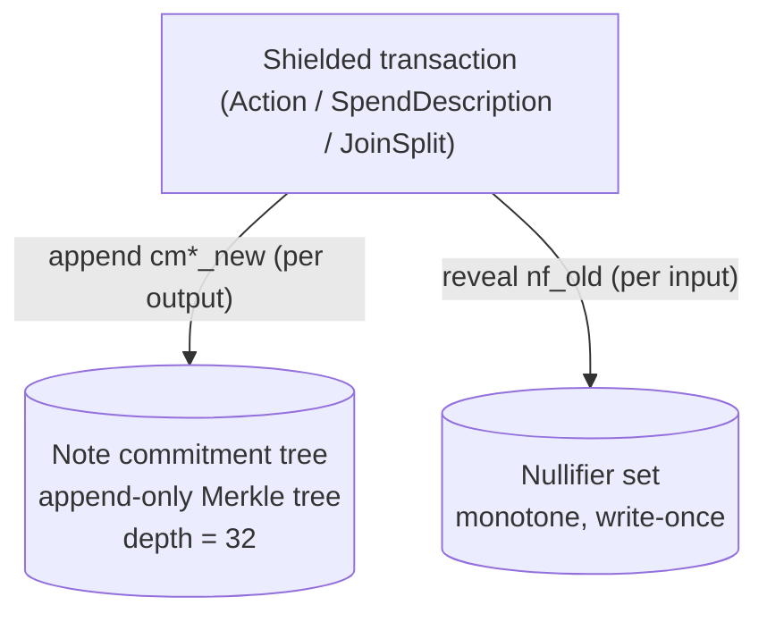
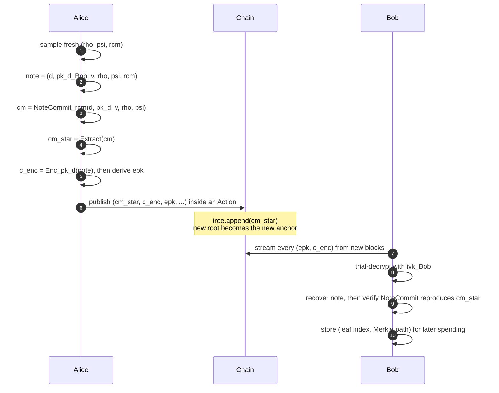
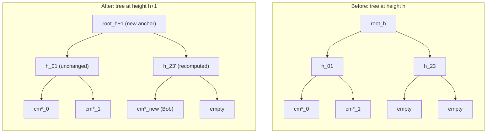
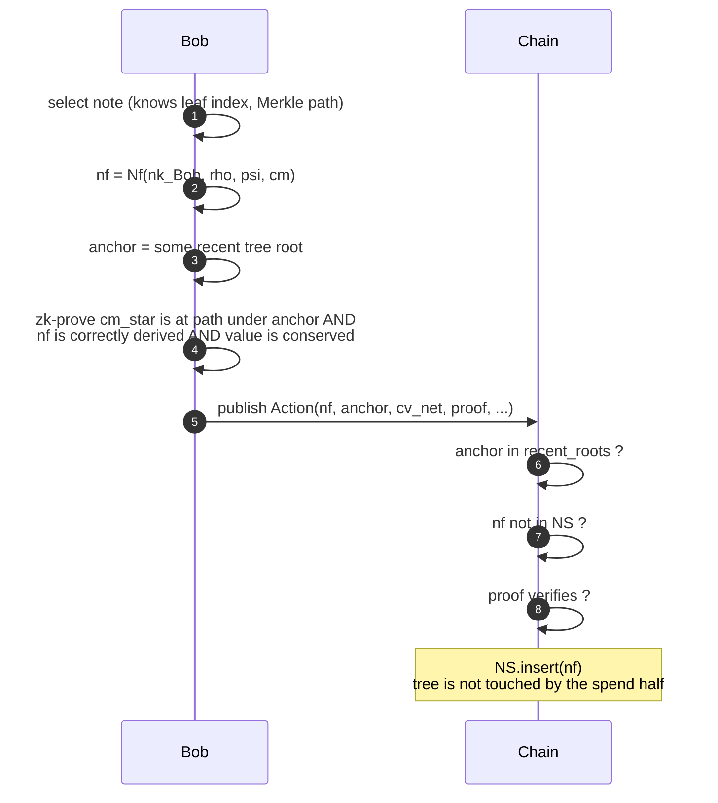
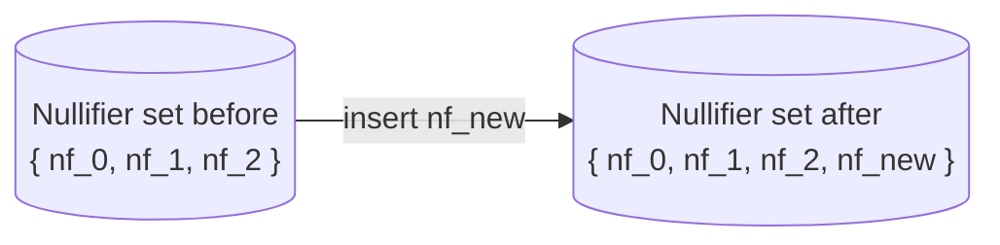

# Background: From Zerocoin to Orchard

This page is the bridge between the cryptography literature and
the rest of the course. It explains the lineage that produced
the Orchard shielded protocol, defines the vocabulary (note,
commitment, anchor, nullifier, action) that the later chapters
use without ceremony, and maps each term to the file in
`zcash/orchard` that owns it.

Read this page first if you have never worked on a shielded
protocol before. Skim it if you have, but return to
[Section 4](#4-the-shielded-pool-vocabulary) whenever a later
chapter uses a term you cannot place.

## 1. Why This Page Exists

`zcash/orchard` does not justify why it exists, who came before
it, or why every note has both an `rho` and a `psi`. Those
facts come from a fifteen-year arc of academic and engineering
work: Zerocoin (2013), Zerocash (2014), Sprout (2016), Sapling
(2018), Orchard (2022). Each generation inherits structure from
the previous one and changes exactly the parts that proved
suboptimal. Without that arc, the constants in `src/spec.rs`
look arbitrary and the choices in `src/circuit.rs` look like
trivia.

A small but load-bearing clarification up front: **Zcash
implements Zerocash, not Zerocoin.** Zerocoin (Miers, Garman,
Green, Rubin, IEEE S&P 2013;
[PDF](https://zerocoin.org/media/pdf/ZerocoinOakland.pdf)) was
the SNARK-free precursor that hid the _link_ between mint and
spend using an RSA accumulator, but left amounts and addresses
public. Zerocash (Ben-Sasson, Chiesa, Garman, Green, Miers,
Tromer, Virza, IEEE S&P 2014;
[PDF](http://zerocash-project.org/media/pdf/zerocash-extended-20140518.pdf);
extended on [ePrint 2014/349](https://eprint.iacr.org/2014/349))
is the SNARK-based successor that hides amounts, addresses, and
the linkage simultaneously by representing payments as
_commitments_ to _notes_ and revealing only deterministic
_nullifiers_ on spend. Every Zcash shielded protocol descends
from Zerocash; none implement Zerocoin.

## 2. Definitions

The names below recur in every chapter. We use the notation from
the
[Zcash Protocol Specification](https://zips.z.cash/protocol/protocol.pdf)
Section 4, and we use Orchard's parameter choices throughout.
Sapling and Sprout differ in the choice of hash and curve but not
in this skeleton.

**Definition (Anonymous payment scheme).** A consensus protocol
that lets a payer transfer value to a payee such that an
external observer learns no more than the rules require:
typically just that value was conserved and no double-spend
occurred. The strongest schemes (Zerocash and its successors)
hide the amount, the sender, and the receiver of every shielded
transaction.

**Definition (Zerocoin).** The first proposal for an anonymous
extension to Bitcoin-style ledgers (Miers et al., IEEE S&P 2013,
[PDF](https://zerocoin.org/media/pdf/ZerocoinOakland.pdf)). Uses
an RSA accumulator over fixed-denomination coins and a
double-discrete-log proof of accumulator membership. No SNARK,
no trusted setup, but proofs are ~25 KiB and only the link
between mint and spend is hidden.

**Definition (Zerocash).** The zk-SNARK-based successor of
Zerocoin (Ben-Sasson et al., IEEE S&P 2014,
[PDF](http://zerocash-project.org/media/pdf/zerocash-extended-20140518.pdf);
[ePrint 2014/349](https://eprint.iacr.org/2014/349)). Represents
payments as commitments to typed records ("notes") that are
appended to a global Merkle tree; spends are proofs of
membership in that tree plus a deterministic nullifier that
prevents double-spending. Hides amounts, sender, receiver, and
linkage. Proof size is ~300 bytes; verification is ~10 ms.

**Definition (Shielded pool).** The set of notes whose
commitments have been published on chain and whose nullifiers
have not. A wallet _shields_ by spending transparent value and
creating shielded notes; it _deshields_ by spending shielded
notes and creating transparent outputs. Each pool (Sprout,
Sapling, Orchard) has its own commitment tree and its own
nullifier set; consensus tracks all three separately.

**Definition (Action).** Orchard's atomic ledger primitive. An
Action symmetrically combines one note spend and one note
output, with shared randomisation and a single circuit. Sapling
kept them apart (`SpendDescription` and `OutputDescription`);
Orchard fused them, both for circuit efficiency and to make the
on-chain shape less informative (see
[Chapter 5](./05-action-circuit.md) "A Note on the Term Action").

## 3. The Lineage

### 3.1 Zerocoin (2013)

| Aspect             | Value                                                                   |
| ------------------ | ----------------------------------------------------------------------- |
| Crypto             | RSA accumulator + double-discrete-log proofs                            |
| Trusted setup      | RSA modulus (later replaced by class groups in follow-up work)          |
| What is hidden     | Linkage between mint and spend                                          |
| What is not hidden | Amount (fixed denomination), and that a shielded op took place          |
| Proof size         | ~25 KiB                                                                 |
| Reference          | [Miers et al. 2013](https://zerocoin.org/media/pdf/ZerocoinOakland.pdf) |

Zerocoin shipped briefly in Zcoin (now Firo) and inspired several
follow-ups (Lelantus, Spark). Zcash does not implement Zerocoin.

### 3.2 Zerocash (2014)

| Aspect             | Value                                                                                                                                               |
| ------------------ | --------------------------------------------------------------------------------------------------------------------------------------------------- |
| Crypto             | Groth16-style zk-SNARK with R1CS arithmetisation                                                                                                    |
| Trusted setup      | Per-circuit, public; produced via a multi-party computation ceremony                                                                                |
| What is hidden     | Amount, sender, receiver, linkage                                                                                                                   |
| What is not hidden | The fact a shielded transaction occurred; net value transferred to/from transparent                                                                 |
| Proof size         | ~300 bytes                                                                                                                                          |
| Verification time  | < 10 ms                                                                                                                                             |
| Reference          | [Ben-Sasson et al. 2014](http://zerocash-project.org/media/pdf/zerocash-extended-20140518.pdf), [ePrint 2014/349](https://eprint.iacr.org/2014/349) |

Zerocash is the construction that Zcash inherited and that
Sprout, Sapling, and Orchard each refine.

### 3.3 Sprout (Zcash mainnet, October 2016)

The first deployed shielded pool. A direct implementation of
Zerocash, with the JoinSplit transaction format and the
parameters in the Zcash Protocol Specification Section 4 (Sprout
parts).

| Aspect               | Value                                                     |
| -------------------- | --------------------------------------------------------- |
| Curve                | alt_bn128 (Barreto-Naehrig, 254-bit, pairing-friendly)    |
| Proof system         | BCTV14, later Groth16-backport                            |
| Note commitment hash | SHA-256 truncated                                         |
| Merkle tree hash     | SHA-256 PRF                                               |
| Trusted setup        | "Sprout MPC", 6 participants                              |
| Transaction format   | JoinSplit (2-in / 2-out per JoinSplit, multiple per tx)   |
| Status               | Deprecated; new value cannot enter the pool               |
| Spec                 | Zcash Protocol Specification, Section 4 (Sprout sections) |

Sprout is interesting historically; no new code is written
against it.

### 3.4 The JoinSplit Primitive

A small clarification up front, since the two terms are easily
confused: **JoinSplit is the transaction primitive used inside
the Sprout pool, not an older name for the pool itself.** The
pool is Sprout; each Sprout shielded transaction contains one or
more JoinSplit descriptions. Sapling and Orchard later replaced
this primitive with different shapes (`SpendDescription`
plus `OutputDescription` in Sapling, `ActionDescription` in
Orchard) while keeping the pool concept.

**Origin.** The construction first appears in the Zerocash 2014
paper as the operation _Pour_ (Section 4.5 of
[Ben-Sasson et al.](http://zerocash-project.org/media/pdf/zerocash-extended-20140518.pdf)).
_Pour_ is a single zk-SNARK statement that consumes two old
coins and produces two new coins, while allowing some net value
to flow to or from a transparent address in the same step. The
[Zcash Protocol Specification](https://zips.z.cash/protocol/protocol.pdf)
(Section 4, Sprout) and the `zcashd` reference implementation
(`JSDescription` in
[`src/primitives/transaction.h`](https://github.com/zcash/zcash/blob/master/src/primitives/transaction.h))
call the deployed counterpart of _Pour_ a **JoinSplit
description**. The 2-in / 2-out shape is the same in both
documents; the same single SNARK statement covers both
shielded-only transfers and the mixed transparent / shielded
cases by setting unused notes or public-value fields to zero.

**Shape.** A single JoinSplit description on the wire contains:

- $v^{\mathsf{pub}}_{\mathsf{old}}$ and
  $v^{\mathsf{pub}}_{\mathsf{new}}$: two 64-bit unsigned
  integers declaring how much transparent value enters the
  shielded pool and how much leaves it in this operation.
- An anchor: a recent Sprout note commitment tree root.
- Two input nullifiers $\mathsf{nf}_1, \mathsf{nf}_2$ (one per
  consumed note).
- Two output commitments $\mathsf{cm}_1, \mathsf{cm}_2$ (one
  per produced note).
- An ephemeral public key plus two ciphertexts encrypting the
  new notes to their recipients.
- A `randomSeed` and two MACs `h_1, h_2` binding the description
  to the spending keys, plus a `joinSplitPubKey` whose signature
  ties the JoinSplits in a transaction together.
- The Groth16-style zk-SNARK proof itself.

A Zcash transaction can carry several JoinSplit descriptions
back to back; consensus checks each one independently and sums
their public-value balances against the transparent inputs and
outputs of the same transaction. This is how one Sprout
transaction can mix shielding, deshielding, and shielded-to-
shielded transfers atomically.

**Why two-in two-out.** Fixing the arity to exactly two on each
side kept the Sprout circuit small enough to be practical on
2016 hardware. Higher arity multiplies the circuit size; lower
arity makes wallet change painful. The shape survived into
Sapling's design discussions and was ultimately replaced by the
separable `SpendDescription` and `OutputDescription`,
so a transaction can have any mix of $m$ inputs and $n$ outputs
and pays only for the operations it actually uses.

**Why it disappeared.** Three reasons:

1. **Circuit cost.** JoinSplit performs spending and outputting
   inside one circuit; Sapling found it cheaper to specialise
   the two halves.
2. **Hash choice.** Sprout's in-circuit SHA-256 was the dominant
   cost; the JoinSplit shape did not survive the redesign that
   moved to Pedersen hashes on Jubjub.
3. **Flexibility.** Fixed 2-in-2-out forced dummy notes for
   asymmetric transactions; Sapling's split descriptions
   eliminated that overhead.

**On chain.** A Sprout transaction wire format encodes each
JoinSplit description as a fixed-size record (the proof is
296 bytes under BCTV14 and 192 bytes after the Groth16
back-port). The full layout is documented in the
[Zcash Protocol Specification](https://zips.z.cash/protocol/protocol.pdf),
Section 7.2 ("JoinSplit Description").

**Code, for reference only.** No new code is written against
Sprout today, but every full node still parses and validates
historical Sprout transactions. The relevant entry points are:

- **zcashd (C++).** `JSDescription` in
  [`src/primitives/transaction.h`](https://github.com/zcash/zcash/blob/master/src/primitives/transaction.h)
  defines the wire layout; the JoinSplit verifier interface is
  [`src/zcash/JoinSplit.hpp`](https://github.com/zcash/zcash/blob/master/src/zcash/JoinSplit.hpp)
  and the underlying `libzcash::ProofVerifier`. Validation is
  driven from
  [`src/main.cpp`](https://github.com/zcash/zcash/blob/master/src/main.cpp)
  via `CheckTransactionWithoutProofVerification` and
  `ContextualCheckTransaction`. Browse the generated doxygen at
  [dannywillems.github.io/zcashd](https://dannywillems.github.io/zcashd),
  starting at `JSDescription` and following the call sites.
- **librustzcash (Rust).** The wire-format type is
  [`zcash_primitives::transaction::components::sprout::JsDescription`](https://github.com/zcash/librustzcash/blob/main/zcash_primitives/src/transaction/components/sprout.rs)
  and the supporting Sprout primitives live in
  [`zcash_primitives::sprout`](https://github.com/zcash/librustzcash/tree/main/zcash_primitives/src/sprout).
  Proof verification is in
  [`zcash_proofs::sprout`](https://github.com/zcash/librustzcash/tree/main/zcash_proofs/src/sprout).
- **Zebra (Rust full node).** The pool type and parser are in
  [`zebra_chain::sprout::joinsplit`](https://github.com/ZcashFoundation/zebra/tree/main/zebra-chain/src/sprout);
  consensus checks live in `zebra-consensus`. Browse the
  rustdoc at
  [dannywillems.github.io/zebra](https://dannywillems.github.io/zebra),
  starting at `zebra_chain::sprout::JoinSplit` and the
  `zebra_chain::sprout::tree` module.
- **Circuit.** The Sprout circuit was first written against
  `libsnark` (in `zcashd`'s `src/zcash/circuit/`), then ported
  to `bellman` for the Groth16 back-port (see
  [ZIP 209](https://zips.z.cash/zip-0209) and surrounding ZIPs).
  Neither circuit sees new development; the `orchard` crate
  intentionally inherits none of this code.

### 3.5 Sapling (Network Upgrade 1, October 2018)

Sapling redesigned the in-circuit primitives for efficiency and
introduced viewing keys and diversified addresses.

| Aspect               | Value                                                                            |
| -------------------- | -------------------------------------------------------------------------------- |
| Curves               | BLS12-381 (proving) + Jubjub (in-circuit, twisted Edwards)                       |
| Proof system         | Groth16                                                                          |
| Note commitment hash | Pedersen hash on Jubjub                                                          |
| Merkle tree hash     | Pedersen hash                                                                    |
| Nullifier PRF        | Blake2s                                                                          |
| Trusted setup        | "Sapling MPC", ~90 participants                                                  |
| Transaction format   | `SpendDescription` (per input) + `OutputDescription` (per output)                |
| Notable additions    | Diversified addresses; full viewing keys; spend-authority signatures (RedJubjub) |
| Implementation       | [`zcash/sapling-crypto`](https://github.com/zcash/sapling-crypto)                |

Sapling is the most-used shielded pool at the time of writing.
The Sapling circuit is **not** a Halo 2 circuit; it uses
`bellman`'s Groth16 backend.

### 3.6 Orchard (Network Upgrade 5, May 2022)

Orchard removed the trusted setup, switched to Halo 2 over the
Pasta cycle, and fused Sapling's separate Spend and Output
descriptions into the single `Action`.

| Aspect               | Value                                                                                                              |
| -------------------- | ------------------------------------------------------------------------------------------------------------------ |
| Curves               | Pallas + Vesta (Pasta cycle)                                                                                       |
| Proof system         | Halo 2 (PLONKish arithmetisation + IPA)                                                                            |
| Note commitment hash | Sinsemilla                                                                                                         |
| Merkle tree hash     | `MerkleCRH^Orchard` (Sinsemilla with depth tag)                                                                    |
| Nullifier PRF        | Poseidon over Pallas                                                                                               |
| Trusted setup        | **None** (transparent setup; the IPA SRS is derived from a published seed)                                         |
| Transaction format   | `ActionDescription` (one per fused spend+output, see [Chapter 12](./12-bundle-and-builder.md))                     |
| Spec                 | [ZIP 224](https://zips.z.cash/zip-0224), [ZIP 225](https://zips.z.cash/zip-0225)                                   |
| Implementation       | [`zcash/orchard`](https://github.com/zcash/orchard) (this crate) + [`zcash/halo2`](https://github.com/zcash/halo2) |

The Orchard circuit lives in
[`src/circuit.rs`](https://github.com/zcash/orchard/blob/f8915bc5c8d1c9fa3124ad28bcf73ce232ef3669/src/circuit.rs)
and is the subject of [Chapter 5](./05-action-circuit.md).

### 3.7 At a Glance

| Property         | Zerocoin   | Zerocash       | Sprout       | Sapling       | Orchard            |
| ---------------- | ---------- | -------------- | ------------ | ------------- | ------------------ |
| SNARK            | no         | yes            | yes (BCTV14) | yes (Groth16) | yes (Halo 2 + IPA) |
| Trusted setup    | no (RSA)   | yes (per-pair) | yes (MPC)    | yes (MPC)     | **no**             |
| Amounts hidden   | no         | yes            | yes          | yes           | yes                |
| Addresses hidden | no         | yes            | yes          | yes           | yes                |
| Curve            | RSA        | various        | alt_bn128    | BLS12-381     | Pallas / Vesta     |
| Embedded curve   | n/a        | n/a            | n/a          | Jubjub        | Pallas             |
| Note hash        | n/a        | SHA-256        | SHA-256      | Pedersen      | Sinsemilla         |
| Nullifier PRF    | RSA accum. | SHA-256        | SHA-256      | Blake2s       | Poseidon           |
| Year             | 2013       | 2014           | 2016         | 2018          | 2022               |

## 4. The Shielded-Pool Vocabulary

The terms below are inherited from Zerocash and recurring across
every chapter. Each one is mapped to the Orchard implementation
and to its Sapling analogue where they differ.

### 4.1 Note

A record describing a single shielded UTXO. In Orchard, a note
is the tuple

$$
\mathsf{note} = (d,\, \mathsf{pk_d},\, v,\, \rho,\, \psi,\, \mathsf{rcm})
$$

with:

- $d$: 88-bit _diversifier_ (an opaque randomisation of the
  recipient's address).
- $\mathsf{pk_d}$: the recipient's diversified transmission key,
  a Pallas point $\mathsf{pk_d} = [\mathsf{ivk}] g_d$ where
  $g_d = \mathsf{DiversifyHash}(d)$.
- $v$: the note value, a 64-bit unsigned integer.
- $\rho$: a Pallas base-field element binding the note to a
  specific predecessor nullifier (the _rho chain_; see
  [Chapter 9](./09-notes-nullifiers-commitments.md)).
- $\psi$: a 255-bit auxiliary randomness derived from $\rho$ and
  the random seed `rseed`.
- $\mathsf{rcm}$: the commitment trapdoor, a Pallas scalar.

Source:
[`src/note.rs`](https://github.com/zcash/orchard/blob/f8915bc5c8d1c9fa3124ad28bcf73ce232ef3669/src/note.rs)
defines `Note`. Sapling's note has the same shape minus the
explicit $\rho$ and $\psi$ fields; those roles split differently.
The Zerocash paper uses the symbol $\mathsf{c}$ where Zcash uses
$\mathsf{note}$.

### 4.2 Note Commitment

A binding, hiding commitment to a note, published on chain:

$$
\mathsf{cm} = \mathsf{NoteCommit}^{\mathsf{Orchard}}_{\mathsf{rcm}}(g_d,\, \mathsf{pk_d},\, v,\, \rho,\, \psi)
$$

implemented in Orchard as a `SinsemillaCommit` under the
personalisation `Z.cash:Orchard-NoteCommit`. The extracted form
$\mathsf{cm}^\star = \mathsf{Extract}_{\mathbb{P}}(\mathsf{cm})$
(the $x$-coordinate of the commitment as a Pallas point) is what
is inserted into the Merkle tree.

Source:
[`src/note/commitment.rs`](https://github.com/zcash/orchard/blob/f8915bc5c8d1c9fa3124ad28bcf73ce232ef3669/src/note/commitment.rs).

In Zerocash this is "cm" or $\mathsf{cm}$ and is computed by a
generic commitment scheme; in Sprout it was SHA-256; in Sapling
it was a Pedersen commitment on Jubjub. Orchard's choice of
Sinsemilla is the one that makes the in-circuit cost manageable
in Halo 2 (see [Chapter 6](./06-sinsemilla.md)).

### 4.3 Note Commitment Tree

A global incremental Merkle tree of all note commitments ever
inserted. Fixed depth $\mathsf{MERKLE\_DEPTH\_ORCHARD} = 32$. The
inner hash is `MerkleCRH^Orchard`, a Sinsemilla hash that
includes the depth as part of its input.

Source:
[`src/tree.rs`](https://github.com/zcash/orchard/blob/f8915bc5c8d1c9fa3124ad28bcf73ce232ef3669/src/tree.rs);
the empty-leaf value
$\mathsf{Uncommitted}_{\mathsf{Orchard}} = 2 \in \mathbb{F}_p$ is
defined there. The frontier maintenance lives in the external
[`incrementalmerkletree`](https://github.com/zcash/incrementalmerkletree)
crate.

In Zerocash this tree is generic; in Sprout the inner hash was
SHA-256 with a fixed `1` byte tag; in Sapling it was a Pedersen
hash; in Orchard it is Sinsemilla.

### 4.4 Anchor

The root of the note commitment tree at some past block height.
An Orchard spend declares an anchor and proves that its input
note's commitment is one of the leaves of the tree with that
root, without revealing which leaf.

Source: `Anchor` in
[`src/tree.rs`](https://github.com/zcash/orchard/blob/f8915bc5c8d1c9fa3124ad28bcf73ce232ef3669/src/tree.rs);
re-exported at the crate root from
[`src/lib.rs`](https://github.com/zcash/orchard/blob/f8915bc5c8d1c9fa3124ad28bcf73ce232ef3669/src/lib.rs).

In Zerocash this is `rt` ("Merkle root"). The naming "anchor"
was introduced in the Zcash Protocol Specification to emphasise
its consensus role.

**Where the anchor actually lives.** The `orchard` crate only
computes roots; it does not persist them. The anchor is
consensus state, owned by the full node, and every full-node
implementation must store enough recent roots to validate a
spend whose declared anchor is up to `AnchorDepth` blocks behind
the chain tip (Zcash Protocol Specification, Section 7.6 of
[protocol.pdf](https://zips.z.cash/protocol/protocol.pdf)).

Two reference implementations are publicly documented:

- **Zebra (Rust, current).** The Orchard commitment tree is
  `zebra_chain::orchard::tree::NoteCommitmentTree`; its root is
  `zebra_chain::orchard::tree::Root` and is re-exported as the
  pool's `Anchor` type. Persistence and the rolling window of
  recent anchors are owned by the `zebra-state` service. Browse
  the generated documentation at
  [dannywillems.github.io/zebra](https://dannywillems.github.io/zebra),
  starting at the `zebra_chain::orchard::tree` module and the
  `zebra_state` crate's `service::finalized_state` module.
- **zcashd (C++, in maintenance).** The same role is filled by
  the `OrchardMerkleFrontier` and the coin/state caches around
  `CCoinsViewCache` and `CChainState`. Browse the doxygen at
  [dannywillems.github.io/zcashd](https://dannywillems.github.io/zcashd),
  starting at `OrchardMerkleFrontier` and following the call
  sites in the block-connect path
  (`ConnectBlock`, `WriteCoinsViewCache`). `zcashd` is in
  maintenance in favour of `zebrad`, but it remains the
  historical reference for edge-case behaviour.

Both implementations expose the anchor through their respective
RPCs (`getrawtransaction` / `z_getorchardanchor` on zcashd,
`getbestchaintip` / state APIs on zebrad). Wallets read it from
there; they never recompute it from the tree.

### 4.5 Nullifier

The unique deterministic identifier of a spent note, revealed
on spend so the chain can reject double-spends:

$$
\mathsf{nf} = \mathsf{Extract}_{\mathbb{P}}\Big(
\big[\mathsf{PRF}^{\mathsf{nfOrchard}}_{\mathsf{nk}}(\rho)\big] \mathcal{K} \;+\; \psi \;+\; \mathsf{cm}
\Big)
$$

where $\mathcal{K}$ is the nullifier base point,
$\mathsf{PRF}^{\mathsf{nfOrchard}}$ is implemented as Poseidon
$P_{128}^{\mathrm{Pasta}}$, and $\mathsf{nk}$ is the
nullifier-deriving key (a private key derived from the spending
key, see [Chapter 8](./08-keys-and-addresses.md)).

Source:
[`src/note/nullifier.rs`](https://github.com/zcash/orchard/blob/f8915bc5c8d1c9fa3124ad28bcf73ce232ef3669/src/note/nullifier.rs).

Sapling computed the nullifier as a Blake2s PRF of $\mathsf{nk}$
and $\rho$; the curve point step is Orchard-specific. Zerocash
uses a generic PRF.

### 4.6 Value Commitment

A homomorphic Pedersen commitment to the note value, in Pallas:

$$
\mathsf{cv} = [v]\, \mathcal{V}^{\mathsf{Orchard}} + [\mathsf{rcv}]\, \mathcal{R}^{\mathsf{Orchard}}.
$$

A bundle publishes $\mathsf{cv^{\mathsf{net}}}$ per Action.
Consensus checks value conservation by verifying a binding
signature on the sum of these commitments (see
[Chapter 13](./13-value-commitments.md)).

Source:
[`src/value.rs`](https://github.com/zcash/orchard/blob/f8915bc5c8d1c9fa3124ad28bcf73ce232ef3669/src/value.rs).

This is conceptually unchanged from Sapling; only the curve
differs. Zerocash relies on value commitments inside the SNARK
rather than as a separate homomorphic commitment.

### 4.7 Diversifier, Address, and the Viewing Keys

The full viewing key derives a per-address _diversifier_ $d$
that randomises the address without changing the underlying
spending key. The incoming viewing key is

$$
\mathsf{ivk} = \mathsf{Commit}^{\mathsf{ivk}}_{\mathsf{rivk}}(\mathsf{ak},\, \mathsf{nk})
$$

where $\mathsf{ak}$ is the spend-authorising public key and
$\mathsf{Commit}^{\mathsf{ivk}}$ is a `SinsemillaCommit` whose
output is a Pallas scalar. The payment address is
$(\mathsf{d},\, \mathsf{pk_d})$.

Source:
[`src/keys.rs`](https://github.com/zcash/orchard/blob/f8915bc5c8d1c9fa3124ad28bcf73ce232ef3669/src/keys.rs)
and [Chapter 8](./08-keys-and-addresses.md).

Diversified addresses were Sapling's innovation; Sprout had a
single payment address per spending key. Zerocash does not
specify a viewing-key model.

### 4.8 Action

The Orchard transaction primitive (see Section 1.3 of
[Chapter 5](./05-action-circuit.md)). An Action description on
chain bundles:

- The input note's nullifier $\mathsf{nf}_{\mathsf{old}}$.
- The output note's commitment $\mathsf{cm}^\star_{\mathsf{new}}$.
- A net value commitment $\mathsf{cv^{\mathsf{net}}}$.
- A randomised spend-authorising key $\mathsf{rk}$.
- An ephemeral key $\mathsf{epk}$ and the encrypted note
  ciphertexts.

A bundle of $N \geq 2$ Actions is proved jointly by one Halo 2
proof and signed by one binding signature plus $N$
spend-authorising signatures.

Source:
[`src/action.rs`](https://github.com/zcash/orchard/blob/f8915bc5c8d1c9fa3124ad28bcf73ce232ef3669/src/action.rs).

In Sapling, this role was split between `SpendDescription` and
`OutputDescription`; in Sprout, between the two halves of a
JoinSplit. The fusion into a single `Action` is the
Orchard-specific change.

## 5. Visualising the Note Lifecycle

The diagrams below cover the entire shielded data flow at the
abstract level shared by Sprout, Sapling, and Orchard. Only the
primitives inside each box differ across the three pools
(SHA-256 vs Pedersen vs Sinsemilla for the note commitment;
SHA-256 PRF vs Blake2s vs Poseidon for the nullifier;
alt_bn128 vs BLS12-381 vs Pallas for the curve). The structural
picture, that is the boxes and arrows, is identical.

### 5.1 The Two Consensus Data Structures

Every shielded pool maintains exactly two pieces of state on
chain: an append-only Merkle tree of all note commitments ever
inserted, and a write-once set of all nullifiers ever revealed. A
shielded transaction inserts one new commitment per output note
and reveals one new nullifier per spent note. Nothing else
mutates the shielded state.

The Merkle tree's root at any block height is called the
**anchor** of that height. A spend declares the anchor it proves
membership against; consensus accepts any recent anchor, which
lets wallets be a few blocks behind without re-proving.

### 5.2 Receiving a Shielded Output

Alice sends `v` zatoshis to Bob. The output flow is the only
mechanism that _creates_ notes; every shielded balance Bob ever
holds enters the wallet through this path.

What changes in the tree when the Action lands. The leaf
`cm*_new` is appended to the first free slot; all sibling hashes
on the path up to the root are recomputed; the new root is the
new anchor.

The on-chain footprint of one received note is exactly `cm*_new`,
the ciphertext `c_enc`, and the ephemeral key `epk`. Nothing
links `cm*_new` to Bob's address or to Alice. Bob learns the
note exists by trial-decrypting every output in every block; this
is cheap because `ivk` is short and decryption fails fast on the
authentication tag.

### 5.3 Spending a Shielded Note

Some time later Bob spends the note. The deterministic nullifier
`nf` is what consensus checks for double-spends; the proof
guarantees Bob really owns a note whose commitment is in the tree
under the declared anchor, without revealing which leaf it is.

The nullifier set after the spend lands. The tree itself is
**not** touched by a pure spend; commitments are append-only and
`cm*_old` stays a leaf forever.

A real Orchard Action always pairs one spend with one output, so
the same Action that reveals `nf_new` also appends a fresh
`cm*_new` for the change note. Dummy notes (value zero) fill out
the spend or output side when only one is needed; see
[Chapter 12](./12-bundle-and-builder.md) on padding.

### 5.4 What an External Observer Sees

For each Action in a block, the chain exposes a small fixed-shape
record. Marked in bold are the parts that mutate consensus state.

| Field              | Visible to all | Mutates state                   |
| ------------------ | -------------- | ------------------------------- |
| `nf_old`           | yes            | **inserted into NS**            |
| `cm*_new`          | yes            | **appended to commitment tree** |
| `cv_net`           | yes            | summed for binding signature    |
| `anchor`           | yes            | checked against recent roots    |
| `epk`, `c_enc`     | yes            | none                            |
| `rk` (rand. spend) | yes            | signature check                 |
| zk-proof           | yes            | verified, then discarded        |

What is **not** visible: which leaf was spent, who owns the
output, the value `v`, the diversifier `d`, or any link between
`cm*_new` and any previous nullifier.

### 5.5 What Changes Between Protocols

The diagrams above are identical for Sprout, Sapling, and
Orchard. The primitives inside each box are not.

| Step                 | Sprout (2016)          | Sapling (2018)     | Orchard (2022)                 |
| -------------------- | ---------------------- | ------------------ | ------------------------------ |
| Note commitment hash | SHA-256 (truncated)    | Pedersen on Jubjub | Sinsemilla on Pallas           |
| Merkle inner hash    | SHA-256 + depth tag    | Pedersen on Jubjub | MerkleCRH_Orchard (Sinsemilla) |
| Nullifier function   | SHA-256 PRF            | Blake2s PRF        | Poseidon + Pallas point ops    |
| zk-SNARK             | BCTV14 / Groth16       | Groth16            | Halo 2 + IPA                   |
| Proving curve        | alt_bn128              | BLS12-381          | Pallas / Vesta                 |
| In-circuit curve     | n/a                    | Jubjub             | Pallas                         |
| Tx primitive         | JoinSplit (2-in 2-out) | Spend + Output     | Action (fused spend+output)    |
| Trusted setup        | yes (MPC)              | yes (MPC)          | none                           |

The words "tree", "nullifier set", "anchor", "commitment", and
"nullifier" carry the exact same consensus meaning in every row;
only the algorithm that produces the bits changes.

## 6. How the Vocabulary Maps to the Crate

| Concept                              | File                                                                                                                              | Chapter                                   |
| ------------------------------------ | --------------------------------------------------------------------------------------------------------------------------------- | ----------------------------------------- |
| `Note`                               | [`src/note.rs`](https://github.com/zcash/orchard/blob/f8915bc5c8d1c9fa3124ad28bcf73ce232ef3669/src/note.rs)                       | [9](./09-notes-nullifiers-commitments.md) |
| `NoteCommitment`, `cm`, `cm*`        | [`src/note/commitment.rs`](https://github.com/zcash/orchard/blob/f8915bc5c8d1c9fa3124ad28bcf73ce232ef3669/src/note/commitment.rs) | [9](./09-notes-nullifiers-commitments.md) |
| `MerkleHashOrchard`, `Anchor`        | [`src/tree.rs`](https://github.com/zcash/orchard/blob/f8915bc5c8d1c9fa3124ad28bcf73ce232ef3669/src/tree.rs)                       | [11](./11-merkle-tree.md)                 |
| `Nullifier`                          | [`src/note/nullifier.rs`](https://github.com/zcash/orchard/blob/f8915bc5c8d1c9fa3124ad28bcf73ce232ef3669/src/note/nullifier.rs)   | [9](./09-notes-nullifiers-commitments.md) |
| `ValueCommitment`, `value_balance`   | [`src/value.rs`](https://github.com/zcash/orchard/blob/f8915bc5c8d1c9fa3124ad28bcf73ce232ef3669/src/value.rs)                     | [13](./13-value-commitments.md)           |
| `SpendingKey`, `FVK`, `ivk`, `ovk`   | [`src/keys.rs`](https://github.com/zcash/orchard/blob/f8915bc5c8d1c9fa3124ad28bcf73ce232ef3669/src/keys.rs)                       | [8](./08-keys-and-addresses.md)           |
| `Action`                             | [`src/action.rs`](https://github.com/zcash/orchard/blob/f8915bc5c8d1c9fa3124ad28bcf73ce232ef3669/src/action.rs)                   | [5](./05-action-circuit.md)               |
| `Bundle`, binding signature          | [`src/bundle.rs`](https://github.com/zcash/orchard/blob/f8915bc5c8d1c9fa3124ad28bcf73ce232ef3669/src/bundle.rs)                   | [12](./12-bundle-and-builder.md)          |
| Action circuit (the SNARK predicate) | [`src/circuit.rs`](https://github.com/zcash/orchard/blob/f8915bc5c8d1c9fa3124ad28bcf73ce232ef3669/src/circuit.rs)                 | [5](./05-action-circuit.md)               |
| Note encryption                      | [`src/note_encryption.rs`](https://github.com/zcash/orchard/blob/f8915bc5c8d1c9fa3124ad28bcf73ce232ef3669/src/note_encryption.rs) | [10](./10-note-encryption.md)             |

## 7. Failure Modes (For the Reader)

Three confusions to avoid when moving between the literature and
the code.

- **Zerocoin vs Zerocash**. Zcash implements **Zerocash**.
  Zerocoin is the SNARK-free precursor with RSA accumulators and
  fixed-denomination coins; Zcash does not use any of it. A
  paper or blog post that conflates the two is unreliable.
- **Sprout vs Sapling vs Orchard primitives**. The three pools
  share the _abstract_ note model but differ on the _concrete_
  primitives (commitment hash, Merkle hash, nullifier PRF,
  curve). Reading a Sapling paper while writing Orchard code is
  fine for structure but dangerous for constants; the Zcash
  Protocol Specification distinguishes them by section
  (Sprout-specific text, Sapling-specific text, Orchard-specific
  text).
- **Domain separation across pools**. Every hash in the code is
  domain-separated by a personalisation string. The string is
  pool-specific (`Zcash_OrchardKDF`, `MerkleCRH^Orchard`, ...).
  Reusing a personalisation across pools would let a malicious
  prover replay a Sapling commitment as an Orchard commitment
  or vice versa; the spec is explicit about this.

## 8. Spec Pointers

Primary sources, in order of relevance to the Orchard crate.

- **Zcash Protocol Specification**, the normative reference for
  all three pools:
  [zips.z.cash/protocol/protocol.pdf](https://zips.z.cash/protocol/protocol.pdf).
  Section 4 ("Abstract Protocol") defines the note model;
  Section 5.4 specialises it to Orchard.
- [ZIP 224 "Orchard Shielded Protocol"](https://zips.z.cash/zip-0224):
  the activation ZIP, normative for consensus.
- [ZIP 225 "Version 5 Transaction Format"](https://zips.z.cash/zip-0225):
  the wire format of `ActionDescription`.
- [ZIP 32 "Shielded HD Wallets"](https://zips.z.cash/zip-0032):
  the hardened-only derivation tree shared across Sapling and
  Orchard.
- [ZIP 212 "Allow Recipient to Derive Ephemeral Secret"](https://zips.z.cash/zip-0212):
  the deterministic note randomness derivation shared across
  Sapling and Orchard.
- [ZIP 316 "Unified Addresses and Viewing Keys"](https://zips.z.cash/zip-0316):
  the cross-pool address format.
- [Zerocoin paper (Miers, Garman, Green, Rubin; IEEE S&P 2013)](https://zerocoin.org/media/pdf/ZerocoinOakland.pdf):
  the historical precursor; Zcash does not implement Zerocoin.
- [Zerocash paper (Ben-Sasson, Chiesa, Garman, Green, Miers, Tromer, Virza; IEEE S&P 2014)](http://zerocash-project.org/media/pdf/zerocash-extended-20140518.pdf),
  extended on
  [ePrint 2014/349](https://eprint.iacr.org/2014/349):
  the construction Sprout, Sapling, and Orchard all inherit.
- [Sapling protocol paper, "Cryptographic primitives" appendix](https://eprint.iacr.org/2018/903):
  the Pedersen-on-Jubjub commitments that Orchard replaced with
  Sinsemilla.
- [Halo paper (Bowe, Grigg, Hopwood; ePrint 2019/1021)](https://eprint.iacr.org/2019/1021):
  the IPA + accumulation construction that lets Orchard avoid a
  trusted setup.
- [Halo 2 Book](https://zcash.github.io/halo2/):
  the proof system Orchard uses.
- [Names, ZIPs, Issues, and PRs](./references.md):
  this course's curated index of every public reference.

## 9. Where to Go Next

After this page, the natural reading order is:

1. [Chapter 1 (Crate and Module Map)](./01-crate-map.md) to see
   how the vocabulary above translates to the file tree.
2. [Chapter 5 (Action Circuit)](./05-action-circuit.md) and
   [Chapter 18 (Shielded Transfers)](./18-shielded-transfers.md)
   for how the vocabulary composes into a real transaction.
3. [Chapter 19 (Research Frontier)](./19-research-frontier.md)
   if you are reading as a cryptographer interested in what
   would come next.
